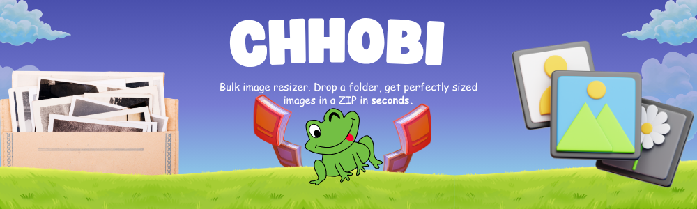

<p align="center">
  
</p>

<h1 align="center">Chhobi</h1>

<p align="center">Bulk image resizer. Drop a folder, get perfectly sized images in a ZIP in seconds.</p>

<p align="center">
  
  
  
  
</p>

---

## What is Chhobi?

Chhobi is a tool that takes a folder full of photos and turns every image into two ready-to-use sizes — a **passport** (600×600) and a **stamp** (300×300) — all packed into a single ZIP file. No manual cropping, no resizing one-by-one, no software to install beyond a simple download.

---

## Why use Chhobi?

- **Save hours of manual work** — processing a folder of 500 photos takes seconds, not an afternoon.
- **No design skills needed** — you don't need Photoshop, GIMP, or any image editor. Just point Chhobi at your folder.
- **Consistent results every time** — every image is cropped to a perfect square and resized to the exact same dimensions. No more uneven batch jobs.

---

## Features

- **Bulk processing** — handles hundreds of images at once, using all the power of your computer.
- **Smart square crop** — automatically crops from the center so nothing important is cut off.
- **Two sizes per image** — each photo becomes a 600×600 passport and a 300×300 stamp.
- **ZIP archive output** — one tidy file with everything organised into `passport/` and `stamp/` folders.
- **Supports JPG and PNG** — the most common photo formats.
- **Cross-platform** — works on Linux, Windows, and macOS.

---

## How to use

### 1. Open a terminal

On Windows, open **Command Prompt** or **PowerShell**. On macOS or Linux, open **Terminal**.

### 2. Run Chhobi

```bash
chhobi --input "path/to/your/photos" --output "resized-photos.zip"
```

| Flag | What it does |
|------|-------------|
| `--input` | The folder containing your original photos |
| `--output` | The ZIP file to create (e.g. `photos.zip`) |

### 3. Find your ZIP

Chhobi creates the ZIP file you named with `--output`. Open it, and you'll see two folders inside:

- `passport/` — 600×600 versions of every photo
- `stamp/` — 300×300 versions of every photo

---

## Example

**Before:** A folder called `wedding-photos` with 200 images (all different sizes: 4000×3000, 1920×1080, 800×600, etc.)

```
wedding-photos/
├── IMG_001.jpg
├── IMG_002.png
├── IMG_003.jpg
└── ...
```

**Run:**

```bash
chhobi --input wedding-photos --output wedding-sizes.zip
```

**After:** A single ZIP file with every photo perfectly cropped and resized.

```
wedding-sizes.zip
├── passport/
│   ├── IMG_001.jpg  (600×600)
│   ├── IMG_002.png  (600×600)
│   ├── IMG_003.jpg  (600×600)
│   └── ...
└── stamp/
    ├── IMG_001.jpg  (300×300)
    ├── IMG_002.png  (300×300)
    ├── IMG_003.jpg  (300×300)
    └── ...
```

---

## FAQ

### Do I need to install anything like Python or Node?

No. Chhobi is a single executable file. Download it, put it somewhere on your computer, and run it.

### Will it overwrite my original photos?

No. Chhobi never touches your originals. It reads them, creates resized copies, and writes them into a new ZIP file. Your originals stay exactly as they are.

### What happens if an image is already square?

It still gets resized to the standard sizes (600×600 and 300×300) so everything in your output is consistent.

---

## License

MIT — use it, share it, modify it. No restrictions.